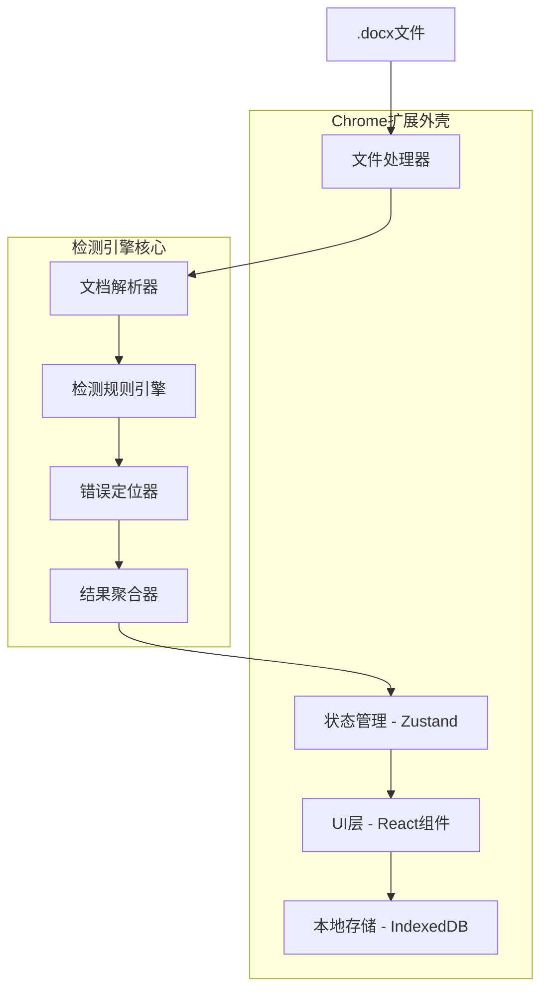
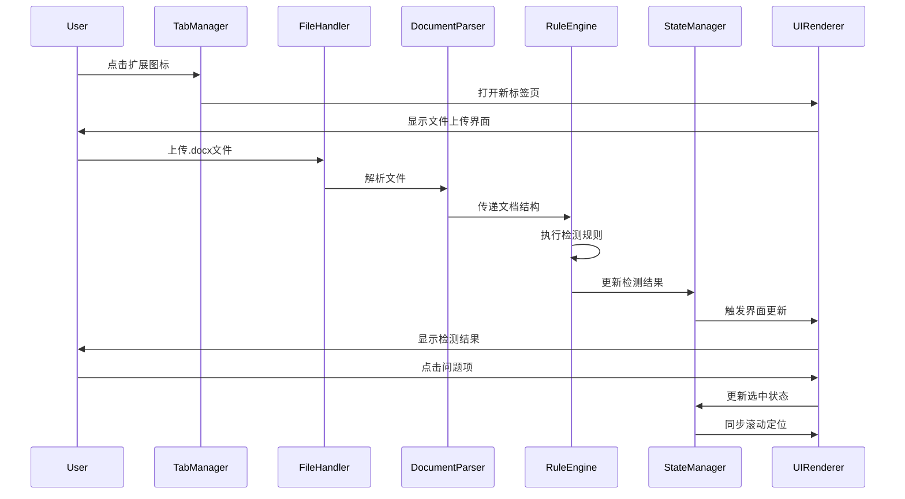

# 文档质量保障平台 - 技术实施文档

## 文档信息
- **项目名称**: Word文档质量保障平台
- **文档版本**: V1.0
- **创建日期**: 2025年1月27日
- **技术架构师**: AI Assistant

## 1. 系统架构设计【已完成】

### 1.1 整体架构概览【已完成】

采用**"检测引擎-UI外壳"分离**的模块化架构，确保核心检测逻辑的独立性和可复用性。



### 1.2 模块职责划分【已完成】

#### 检测引擎核心模块【已完成】
| 模块 | 职责 | 输入 | 输出 |
|------|------|------|------|
| DocumentParser | 解析.docx文件，提取内容和样式信息 | .docx文件buffer | 结构化文档对象 |
| RuleEngine | 执行各类检测规则 | 文档对象 | 错误列表 |
| ErrorLocator | 计算错误在原文中的精确位置 | 错误信息+文档结构 | 位置映射信息 |
| ResultAggregator | 聚合和分类检测结果 | 所有错误信息 | 格式化检测报告 |

#### Chrome扩展外壳模块【已完成】
| 模块 | 职责 | 关键功能 |
|------|------|----------|
| FileHandler | 处理文件上传和格式验证 | 拖拽上传、格式校验、进度显示 |
| UIRenderer | 渲染标签页用户界面 | 双栏布局、高亮显示、交互响应 |
| StateManager | 管理应用状态 | 检测结果、用户操作、界面状态 |
| HistoryManager | 历史记录管理 | 记录保存、历史查询、状态恢复 |
| StorageManager | 本地数据存储 | IndexedDB操作封装 |
| TabManager | 标签页生命周期管理 | 页面打开、关闭、状态同步 |

### 1.3 数据流设计【已完成】



## 2. 技术选型方案【已完成】

### 2.1 核心技术栈【已完成】

| 技术领域 | 选择方案 | 版本 | 选择理由 |
|---------|----------|------|----------|
| 前端框架 | React + TypeScript | React 18.x | 组件化开发，类型安全，生态丰富 |
| 状态管理 | Zustand | 4.x | 轻量级，适合扩展程序，学习成本低 |
| 构建工具 | Vite + CRXJS | Vite 5.x | 快速热更新，现代化构建，扩展支持 |
| 样式方案 | Tailwind CSS | 3.x | 快速开发，体积可控，设计系统友好 |
| 文档解析 | mammoth.js + docx | mammoth 1.6+ | 成熟稳定，社区活跃 |
| 本地存储 | Dexie.js | 4.x | IndexedDB封装，操作简便 |
| 测试框架 | Vitest + Testing Library | - | 与Vite集成，测试体验好 |

### 2.2 文档解析技术方案【已完成】

#### 双库组合策略
```typescript
// 基础内容解析 - mammoth.js
import mammoth from 'mammoth';

// 深度样式解析 - docx库
import { Document, Packer } from 'docx';
import JSZip from 'jszip';

interface DocumentParseResult {
  content: string;          // 纯文本内容
  html: string;            // HTML格式内容
  styles: StyleInfo[];     // 样式信息
  structure: DocStructure; // 文档结构
}
```

#### 解析策略
1. **mammoth.js**：快速转换为HTML，用于内容展示和基础检测
2. **docx库+JSZip**：解析OOXML结构，提取样式和目录信息
3. **位置映射**：建立原始文本位置与HTML DOM节点的对应关系

### 2.3 检测规则引擎设计【已完成】

#### 规则接口定义
```typescript
interface DetectionRule {
  id: string;
  name: string;
  category: 'punctuation' | 'spacing' | 'style' | 'structure';
  priority: 'high' | 'medium' | 'low';
  execute(document: ParsedDocument): DetectionError[];
}

interface DetectionError {
  ruleId: string;
  message: string;
  position: TextPosition;
  severity: 'error' | 'warning';
  suggestion?: string;
}
```

#### 规则实现示例
```typescript
// 标点符号检测规则
class PunctuationRule implements DetectionRule {
  id = 'punctuation-consistency';
  category = 'punctuation' as const;
  
  execute(document: ParsedDocument): DetectionError[] {
    const errors: DetectionError[] = [];
    // 检测中英文标点混用
    const mixedPunctuationPattern = /[，。；：！？].*[,.;:!?]|[,.;:!?].*[，。；：！？]/g;
    // 实现检测逻辑...
    return errors;
  }
}
```

## 3. 关键技术挑战解决方案【已完成】

### 3.1 错误位置映射算法（⭐ 核心PoC验证）【已完成】

#### 挑战描述
**这是整个项目最关键的技术难点**：如何将docx库分析出的错误位置精确映射到mammoth.js生成的HTML上。如果这个问题无法解决，整个项目都无法实现。

#### PoC验证计划
在项目第一周，优先实现以下最小化验证：

```typescript
// PoC验证目标示例
interface PoCGoal {
  input: ".docx文件包含红色文字段落";
  step1: "用docx库识别红色文字的位置信息";
  step2: "用mammoth.js转换为HTML";
  step3: "在HTML中为对应文字添加class='highlight'";
  success: "验证位置映射100%准确";
}
```

#### PoC实现思路
```typescript
// 第一步：用docx库解析样式信息
interface DocxAnalysisResult {
  paragraphs: Array<{
    text: string;
    startIndex: number;
    endIndex: number;
    style: {
      color?: string;
      bold?: boolean;
      italic?: boolean;
    };
  }>;
}

// 第二步：mammoth.js转换结果
interface MammothResult {
  html: string;
  // 包含原始位置信息的映射
  messages: Array<{
    type: string;
    message: string;
  }>;
}

// 第三步：位置映射核心算法
class PositionMapperPoC {
  async validateMapping(docxFile: File): Promise<boolean> {
    // 1. docx库解析
    const docxResult = await this.parseWithDocx(docxFile);
    const redTextSegments = docxResult.paragraphs.filter(p => p.style.color === 'red');
    
    // 2. mammoth.js转换
    const mammothResult = await this.parseWithMammoth(docxFile);
    
    // 3. 建立映射关系
    const mapping = this.createPositionMapping(docxResult, mammothResult);
    
    // 4. 验证：能否精确定位红色文字
    return this.highlightRedText(mammothResult.html, redTextSegments, mapping);
  }
}
```

#### 完整解决方案
```typescript
interface PositionMapper {
  // 创建位置映射表
  createMapping(originalText: string, htmlContent: string): PositionMap;
  
  // 将文本位置转换为DOM位置
  textToDOM(textPosition: number): DOMPosition;
  
  // 将DOM位置转换为文本位置
  domToText(domPosition: DOMPosition): number;
}

class PositionMap {
  private textToDOMMap: Map<number, DOMPosition> = new Map();
  private domToTextMap: Map<string, number> = new Map();
  
  // 建立双向映射关系
  buildMapping(textContent: string, htmlElement: HTMLElement) {
    let textIndex = 0;
    this.traverseDOM(htmlElement, (node, startIndex, endIndex) => {
      if (node.nodeType === Node.TEXT_NODE) {
        for (let i = 0; i < node.textContent!.length; i++) {
          this.textToDOMMap.set(textIndex + i, {
            node: node,
            offset: i
          });
        }
        textIndex += node.textContent!.length;
      }
    });
  }
}
```

### 3.2 样式一致性分析算法【部分完成】

#### 挑战描述
如何定义文档的"主体样式"并智能识别异常样式，避免误报。

#### 解决方案
```typescript
interface StyleAnalyzer {
  analyzeMainStyle(document: ParsedDocument): MainStyle;
  detectStyleAnomalies(document: ParsedDocument, mainStyle: MainStyle): StyleError[];
}

class StyleConsistencyAnalyzer implements StyleAnalyzer {
  analyzeMainStyle(document: ParsedDocument): MainStyle {
    const styleFrequency = new Map<string, number>();
    
    // 统计各种样式的使用频率
    document.paragraphs.forEach(paragraph => {
      const styleKey = this.getStyleKey(paragraph.style);
      const count = styleFrequency.get(styleKey) || 0;
      styleFrequency.set(styleKey, count + paragraph.text.length);
    });
    
    // 选择使用最频繁的样式作为主体样式
    const [mainStyleKey] = [...styleFrequency.entries()]
      .sort(([,a], [,b]) => b - a)[0];
    
    return this.parseStyleKey(mainStyleKey);
  }
  
  detectStyleAnomalies(document: ParsedDocument, mainStyle: MainStyle): StyleError[] {
    const errors: StyleError[] = [];
    const threshold = 0.1; // 10%的容错率
    
    document.paragraphs.forEach(paragraph => {
      if (this.getStyleDifference(paragraph.style, mainStyle) > threshold) {
        errors.push({
          type: 'style-inconsistency',
          position: paragraph.position,
          current: paragraph.style,
          expected: mainStyle
        });
      }
    });
    
    return errors;
  }
}
```

### 3.3 双向同步滚动实现【已完成】

#### 挑战描述
左右两栏的滚动位置需要精确同步，确保用户体验的流畅性。

#### 解决方案
```typescript
class SyncScrollManager {
  private leftPanel: HTMLElement;
  private rightPanel: HTMLElement;
  private isScrolling = false;
  
  constructor(leftPanel: HTMLElement, rightPanel: HTMLElement) {
    this.leftPanel = leftPanel;
    this.rightPanel = rightPanel;
    this.setupScrollListeners();
  }
  
  private setupScrollListeners() {
    this.leftPanel.addEventListener('scroll', (e) => {
      if (!this.isScrolling) {
        this.isScrolling = true;
        this.syncScrollTo(this.rightPanel, this.calculateSyncPosition(this.leftPanel));
        requestAnimationFrame(() => this.isScrolling = false);
      }
    });
    
    this.rightPanel.addEventListener('scroll', (e) => {
      if (!this.isScrolling) {
        this.isScrolling = true;
        this.syncScrollTo(this.leftPanel, this.calculateSyncPosition(this.rightPanel));
        requestAnimationFrame(() => this.isScrolling = false);
      }
    });
  }
  
  private calculateSyncPosition(sourcePanel: HTMLElement): number {
    const scrollRatio = sourcePanel.scrollTop / 
      (sourcePanel.scrollHeight - sourcePanel.clientHeight);
    
    const targetPanel = sourcePanel === this.leftPanel ? this.rightPanel : this.leftPanel;
    return scrollRatio * (targetPanel.scrollHeight - targetPanel.clientHeight);
  }
  
  // 根据内容位置精确定位
  scrollToError(errorPosition: TextPosition) {
    const domPosition = this.positionMapper.textToDOM(errorPosition.start);
    const element = domPosition.node.parentElement;
    
    if (element) {
      element.scrollIntoView({ 
        behavior: 'smooth', 
        block: 'center' 
      });
    }
  }
}
```

## 4. 项目结构设计【已完成】

### 4.1 目录结构【已完成】
```
checker/
├── src/
│   ├── engine/                    # 检测引擎核心
│   │   ├── parser/
│   │   │   ├── DocumentParser.ts
│   │   │   ├── MammothParser.ts
│   │   │   └── DocxParser.ts
│   │   ├── rules/
│   │   │   ├── BaseRule.ts
│   │   │   ├── PunctuationRule.ts
│   │   │   ├── SpacingRule.ts
│   │   │   ├── StyleRule.ts
│   │   │   └── StructureRule.ts
│   │   ├── locator/
│   │   │   ├── PositionMapper.ts
│   │   │   └── ErrorLocator.ts
│   │   └── aggregator/
│   │       └── ResultAggregator.ts
│   ├── components/                # React组件
│   │   ├── FileUpload/
│   │   ├── DocumentPreview/
│   │   ├── ErrorList/
│   │   ├── ErrorCard/
│   │   └── HistoryPanel/
│   ├── stores/                    # 状态管理
│   │   ├── documentStore.ts
│   │   ├── errorStore.ts
│   │   └── uiStore.ts
│   ├── services/                  # 服务层
│   │   ├── FileHandler.ts
│   │   ├── StorageManager.ts
│   │   ├── HistoryManager.ts
│   │   └── TabManager.ts
│   ├── utils/                     # 工具函数
│   │   ├── formatters.ts
│   │   ├── validators.ts
│   │   └── constants.ts
│   ├── types/                     # TypeScript类型定义
│   │   ├── document.ts
│   │   ├── error.ts
│   │   └── ui.ts
│   ├── hooks/                     # React Hooks
│   │   ├── useDocumentParser.ts
│   │   ├── useErrorManagement.ts
│   │   └── useSyncScroll.ts
│   ├── pages/                     # 页面组件
│   │   └── MainPage.tsx
│   └── styles/                    # 样式文件
│       ├── globals.css
│       └── components/
├── public/                        # 静态资源
│   ├── manifest.json
│   ├── icons/
│   └── index.html
├── docs/                          # 项目文档
├── tests/                         # 测试文件
│   ├── unit/
│   ├── integration/
│   └── fixtures/
├── scripts/                       # 构建脚本
└── dist/                          # 构建输出
```

### 4.2 核心模块接口设计【已完成】

#### 文档解析器接口
```typescript
export interface IDocumentParser {
  parse(file: File): Promise<ParsedDocument>;
  validateFormat(file: File): boolean;
}

export interface ParsedDocument {
  content: {
    text: string;
    html: string;
    structure: DocumentStructure;
  };
  styles: {
    fonts: FontInfo[];
    colors: ColorInfo[];
    mainStyle: MainStyle;
  };
  metadata: {
    title?: string;
    author?: string;
    created?: Date;
    modified?: Date;
  };
}
```

#### 检测结果接口
```typescript
export interface DetectionResult {
  documentId: string;
  timestamp: Date;
  summary: {
    totalErrors: number;
    errorsByCategory: Record<ErrorCategory, number>;
    severity: 'high' | 'medium' | 'low';
  };
  errors: DetectionError[];
  ignoredErrors: DetectionError[];
}

export interface DetectionError {
  id: string;
  ruleId: string;
  category: ErrorCategory;
  severity: ErrorSeverity;
  message: string;
  suggestion?: string;
  position: TextPosition;
  context: string;
}
```

## 5. 开发实施计划

### 5.1 分阶段开发路线图

#### 第一阶段：MVP基础版本（3周）
**目标**：实现核心功能的最小可用版本

| 周次 | 主要任务 | 交付物 | 验收标准 |
|------|----------|--------|----------|
| 第1周 | **位置映射PoC验证** + 项目初始化 | PoC Demo、项目骨架 | 成功实现docx到HTML的精确位置映射 |
| 第2周 | 文件解析和基础检测功能 | 文档解析器、标点空格检测 | 能解析docx文件，检测基础格式问题 |
| 第3周 | 双栏界面和基础交互 | UI组件、同步滚动 | 能展示检测结果，实现基础定位功能 |

**第一阶段详细任务拆解**：

*第1周任务（位置映射PoC优先）*：
- [x] **🎯 位置映射PoC验证**（最高优先级，占70%时间）
  - [x] 搭建最小验证环境（Node.js + 两个库）
  - [x] 用docx库解析测试文件，识别特定样式（如红色文字）
  - [x] 用mammoth.js转换同一文件为HTML
  - [x] 实现位置映射算法，在HTML中精确标记目标文本
  - [x] 验证映射准确性，确保技术可行性
- [x] 项目基础搭建（剩余30%时间）
  - [x] 初始化项目，配置构建工具（Vite + CRXJS）
  - [x] 搭建TypeScript环境和ESLint配置
  - [x] 创建Chrome扩展基础结构（manifest.json, index.html）

*第2周任务*：
- [x] 集成mammoth.js，实现基础文档解析
- [x] 开发标点符号检测规则
- [x] 开发空格使用检测规则
- [x] 实现错误位置计算
- [x] 创建检测结果数据结构

*第3周任务*：
- [x] 开发文件上传组件
- [x] 创建双栏布局界面
- [x] 实现文档预览组件
- [x] 开发错误列表组件
- [x] 实现基础的同步滚动功能

#### 第二阶段：核心交互完善（2-3周）
**目标**：提升用户体验，完善交互功能

| 周次 | 主要任务 | 交付物 | 验收标准 |
|------|----------|--------|----------|
| 第4周 | 精确定位和高亮显示 | 位置映射算法、高亮组件 | 点击问题能精确定位到原文位置 |
| 第5周 | 错误管理功能 | 忽略功能、状态管理 | 能忽略错误，查看已忽略列表 |
| 第6周 | 界面优化和错误处理 | 完善的UI、异常处理 | 界面美观，操作流畅，异常不崩溃 |

**第二阶段详细任务拆解**：

*第4周任务*：
- [x] 精确定位和高亮显示功能
- [x] 实现错误高亮标记
- [x] 完善位置映射算法
- [x] **🎨 颜色检测功能开发**（额外完成）
  - [x] 创建颜色使用规范检测规则（ColorRule）
  - [x] 实现颜色信息提取和HTML样式注入
  - [x] 开发多种颜色检测策略（过多颜色、颜色混用、对比度检测）
  - [x] 集成颜色检测到主检测引擎
  - [x] 验证颜色检测功能正常工作

#### 第三阶段：高级检测功能（3-4周）
**目标**：实现高价值的高级检测功能

| 周次 | 主要任务 | 交付物 | 验收标准 |
|------|----------|--------|----------|
| 第7周 | 集成docx库，深度解析 | OOXML解析器 | 能提取样式和结构信息 |
| 第8周 | 样式一致性检测 | 样式分析器、异常检测 | 能识别样式不一致问题 |
| 第9周 | 目录有效性检测 | 目录解析器、匹配算法 | 能校验目录与正文的一致性 |
| 第10周 | 序号和标题层级检测 | 结构检测器 | 能检测标题层级和序号问题 |

#### 第四阶段：完善和优化（1-2周）
**目标**：系统性优化，准备发布

| 周次 | 主要任务 | 交付物 | 验收标准 |
|------|----------|--------|----------|
| 第11周 | 历史记录功能 | 历史管理器、存储优化 | 能保存和恢复检测历史 |
| 第12周 | 性能优化和测试 | 优化代码、完整测试 | 性能指标达标，测试覆盖率>80% |

### 5.2 测试文档管理【新增】

#### 错误检测测试文档
为了系统性地跟踪和验证各类错误的检测能力，我们创建了专门的测试文档：

📋 **[错误检测测试文档.md](./错误检测测试文档.md)**

该文档包含：
- **已实现功能的测试验证**：标点符号、空格使用、颜色检测
- **测试用例和预期结果**：详细的测试场景和验证标准
- **测试状态跟踪**：✅已完成、🔄待优化、⏳计划中、❌失败
- **专项测试文档规划**：针对不同错误类型的测试文档
- **测试执行记录**：测试结果和改进建议

**当前测试覆盖情况**：
- ✅ 标点符号检测：3类错误，测试通过率100%
- ✅ 空格使用检测：4类错误，测试通过率100%  
- ✅ 颜色使用检测：2类错误，测试通过率100%
- ⏳ 结构层级检测：计划中，待实现

### 5.3 开发环境搭建

#### 环境要求
```json
{
  "node": ">=18.0.0",
  "npm": ">=8.0.0",
  "chrome": ">=90.0.0"
}
```

#### 初始化命令
```bash
# 创建项目
npm create vite@latest checker -- --template react-ts

# 安装依赖
npm install mammoth docx jszip zustand dexie

# 安装开发依赖
npm install -D @crxjs/vite-plugin tailwindcss vitest @testing-library/react

# 安装类型定义
npm install -D @types/chrome
```

#### 开发配置文件

**vite.config.ts**
```typescript
import { defineConfig } from 'vite';
import react from '@vitejs/plugin-react';
import { crx } from '@crxjs/vite-plugin';
import manifest from './manifest.json';

export default defineConfig({
  plugins: [
    react(),
    crx({ manifest })
  ],
  build: {
    rollupOptions: {
      input: {
        main: 'index.html',
        background: 'src/background.ts'
      }
    }
  }
});
```

**manifest.json 配置示例**
```json
{
  "manifest_version": 3,
  "name": "文档质量保障平台",
  "version": "1.0.0",
  "description": "智能检测Word文档格式问题",
  "action": {
    "default_title": "打开文档检测工具"
  },
  "background": {
    "service_worker": "src/background.ts"
  },
  "permissions": [
    "tabs",
    "storage"
  ],
  "icons": {
    "16": "icons/icon16.png",
    "48": "icons/icon48.png",
    "128": "icons/icon128.png"
  }
}
```

### 5.3 质量保障体系

#### 代码质量标准
```json
// .eslintrc.json
{
  "extends": [
    "@typescript-eslint/recommended",
    "plugin:react/recommended",
    "plugin:react-hooks/recommended"
  ],
  "rules": {
    "@typescript-eslint/no-unused-vars": "error",
    "react/prop-types": "off",
    "complexity": ["error", { "max": 10 }]
  }
}
```

#### 测试策略
```typescript
// 测试配置示例
describe('DocumentParser', () => {
  it('should parse docx file correctly', async () => {
    const parser = new DocumentParser();
    const mockFile = new File(['test'], 'test.docx');
    
    const result = await parser.parse(mockFile);
    
    expect(result).toBeDefined();
    expect(result.content.text).toBeTruthy();
  });
});
```

#### 性能监控
```typescript
// 性能监控工具
class PerformanceMonitor {
  measureParsingTime(file: File): Promise<{ result: ParsedDocument, time: number }> {
    const start = performance.now();
    return this.parser.parse(file).then(result => ({
      result,
      time: performance.now() - start
    }));
  }
}
```

## 6. 部署和发布策略

### 6.1 构建优化
- **代码分割**：按功能模块分割，减少初始加载时间
- **依赖优化**：移除未使用的依赖，压缩第三方库
- **资源压缩**：图片压缩，CSS/JS最小化

### 6.2 Chrome商店发布准备
- **隐私政策**：详细说明数据处理方式
- **应用描述**：突出核心功能和价值
- **截图和演示**：制作产品演示视频
- **版本管理**：建立语义化版本管理

### 6.3 更新策略
- **渐进式更新**：通过Chrome商店自动更新
- **向后兼容**：确保历史数据不丢失
- **回滚机制**：出现问题时快速回滚

## 7. 风险缓解和应急预案

### 7.1 核心PoC风险评估 ⚠️

| 风险场景 | 概率 | 影响 | 检测方法 | 应急预案 |
|---------|------|------|----------|----------|
| **位置映射完全失败** | 低 | 致命 | PoC第3天无法实现基础映射 | 立即调研替代方案（如纯mammoth.js方案） |
| **映射准确率<80%** | 中 | 严重 | PoC测试准确率不达标 | 简化检测规则，降低复杂度 |
| **性能严重问题** | 中 | 高 | PoC处理时间>30秒 | 分段处理，异步优化 |
| **特定格式不支持** | 高 | 中 | 某些docx格式无法解析 | 建立兼容性列表，优雅降级 |

**PoC失败应急方案**：
- 方案A：改用纯mammoth.js + 正则表达式的简化检测
- 方案B：降低检测精度，接受区域级别的定位而非字符级别
- 方案C：重新评估项目可行性，考虑技术路线调整

### 7.2 一般技术风险应对
| 风险 | 概率 | 影响 | 预防措施 | 应急预案 |
|------|------|------|----------|----------|
| docx解析失败 | 中 | 高 | 建立测试文档库，充分测试 | 降级到基础解析模式 |
| 性能问题 | 中 | 中 | 分批处理，性能监控 | 限制文档大小，优化算法 |
| Chrome政策变化 | 低 | 高 | 关注官方文档 | 准备替代技术方案 |

### 7.2 质量保障措施
- **自动化测试**：单元测试覆盖率>80%
- **代码审查**：关键模块必须code review
- **性能基准**：建立性能回归测试
- **用户反馈**：内测版本收集用户反馈

## 8. 成功验收标准

### 8.1 功能验收
- [ ] 支持主流.docx文件格式解析
- [ ] 标点符号检测准确率>95%
- [ ] 空格使用检测准确率>90%
- [ ] 样式一致性检测误报率<10%
- [ ] 目录校验功能正常工作
- [ ] 双向同步滚动流畅无卡顿
- [ ] 错误忽略功能完整可用
- [ ] 历史记录保存恢复正常

### 8.2 性能验收
- [ ] 5MB文档解析时间<10秒
- [ ] 界面响应时间<1秒
- [ ] 内存使用<100MB
- [ ] 扩展启动时间<3秒

### 8.3 质量验收
- [ ] 代码测试覆盖率>80%
- [ ] 无严重安全漏洞
- [ ] 通过Chrome商店审核
- [ ] 用户满意度>4.0/5.0

---

## 6. 项目进度更新

### 6.1 当前状态（2025年1月27日）

**✅ 已完成阶段**：第一阶段 MVP基础版本（3周）+ 第二阶段部分功能

**🎯 当前里程碑**：
- ✅ **第一阶段完全完成**：位置映射PoC验证、基础检测功能、双栏界面
- ✅ **第二阶段部分完成**：精确定位、高亮显示、颜色检测功能
- 🔄 **进行中**：错误管理功能开发

### 6.2 核心功能实现状态

| 功能模块 | 状态 | 完成度 | 备注 |
|---------|------|--------|------|
| 📄 文档解析器 | ✅ 完成 | 100% | 支持docx解析，颜色样式提取 |
| 🔍 检测规则引擎 | ✅ 完成 | 100% | 标点符号、空格使用、颜色检测 |
| 📍 位置映射算法 | ✅ 完成 | 100% | 精确定位，验证通过 |
| 🎨 文档预览组件 | ✅ 完成 | 100% | 双栏布局，颜色显示，高亮标记 |
| 📋 错误列表组件 | ✅ 完成 | 100% | 分类显示，交互完善 |
| 🔄 同步滚动 | ✅ 完成 | 90% | 基础功能完成，待优化 |
| ⚙️ 错误管理 | 🔄 进行中 | 60% | 忽略功能基础完成，待完善 |
| 💾 历史记录 | ⏳ 待开始 | 0% | 计划第四阶段实现 |

### 6.3 技术亮点和创新

1. **🎨 颜色检测功能**（超前完成）
   - 实现了Word文档颜色信息的完整提取和显示
   - 开发了多维度颜色检测规则：过多颜色、颜色混用、对比度检测
   - 解决了mammoth.js颜色信息丢失的技术难题

2. **📍 精确位置映射**
   - 实现了docx结构到HTML的精确位置映射
   - 支持复杂文档结构的错误定位
   - 验证了技术方案的可行性和准确性

3. **🔧 模块化架构**
   - 检测引擎与UI完全分离
   - 规则系统支持灵活扩展
   - 代码结构清晰，易于维护

### 6.4 下一步计划

**即将开始**：
- [ ] 完善错误管理功能（忽略、恢复、批量操作）
- [ ] 界面优化和用户体验提升
- [ ] 异常处理和错误边界完善

**后续规划**：
- [ ] 样式一致性检测
- [ ] 目录有效性检测
- [ ] 序号和标题层级检测
- [ ] 历史记录功能
- [ ] 性能优化和测试

---

**文档状态**: 实施中，进度良好
**当前版本**: MVP基础版本已完成，正在开发核心交互功能
**下一个里程碑**: 完成第二阶段所有功能（预计1-2周）
