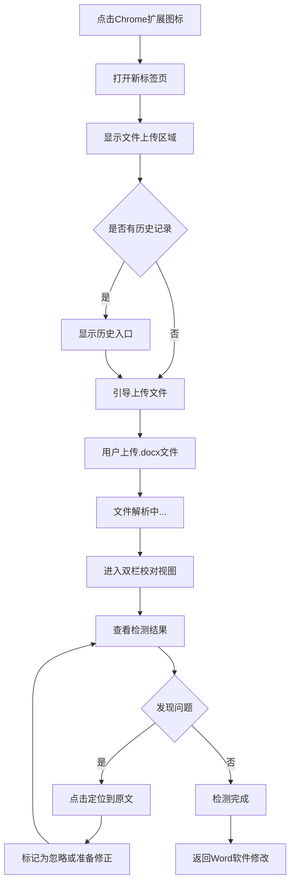

# 文档质量保障平台 - 需求分析文档

## 文档信息
- **项目名称**: Word文档质量保障平台
- **文档版本**: V1.0
- **创建日期**: 2025年1月27日
- **分析基于**: 产品需求文档 V1.3

## 1. 需求概述分析

### 1.1 产品定位
本产品是一个**Chrome浏览器扩展程序**，专注于对`.docx`格式Word文档进行智能质量检测。产品的核心价值在于：
- **自动化检测**：替代人工校对，提高效率
- **交互式修正**：通过可视化界面，快速定位和理解问题
- **隐私保护**：本地处理，无需上传敏感文档

### 1.2 目标用户画像
| 用户群体 | 核心需求 | 使用场景 | 痛点 |
|---------|----------|----------|------|
| 学术用户（学生、研究人员） | 严格格式规范 | 论文、报告撰写 | 格式要求复杂，手动校对耗时 |
| 职场人士（项目经理、分析师） | 文档专业性 | 工作报告、商业文档 | 团队文档格式不统一 |
| 内容创作者（编辑、写手） | 批量处理能力 | 稿件编辑、格式标准化 | 大量文档处理效率低 |

### 1.3 核心价值主张
1. **效率提升**：将传统需要数小时的手动校对缩短至分钟级别
2. **质量保障**：系统化检测，减少遗漏和错误
3. **学习价值**：帮助用户建立规范的文档撰写习惯

## 2. 功能需求深度分析

### 2.1 功能优先级矩阵

| 功能模块 | 业务价值 | 技术复杂度 | 优先级 | 开发排序 |
|---------|----------|------------|--------|----------|
| 文件上传解析 | 高 | 中 | P0 | 1 |
| 基础检测（标点、空格） | 高 | 低 | P0 | 2 |
| 双栏展示界面 | 高 | 中 | P0 | 3 |
| 同步滚动定位 | 高 | 高 | P0 | 4 |
| 错误忽略功能 | 中 | 低 | P1 | 5 |
| 样式一致性检测 | 中 | 高 | P1 | 6 |
| 目录有效性检测 | 中 | 高 | P1 | 7 |
| 历史记录管理 | 低 | 中 | P2 | 8 |

### 2.2 核心用户故事拆解

#### 用户故事1：学术论文校对
```
作为一名研究生
我想要上传我的毕业论文docx文件
以便自动检测出所有格式不规范的地方
这样我就能确保论文符合学校要求
```

**验收标准**：
- [ ] 支持拖拽上传.docx文件
- [ ] 能检测出中英文标点混用问题
- [ ] 能检测出空格使用不当问题
- [ ] 检测结果按类型分类展示
- [ ] 点击问题能定位到原文位置

#### 用户故事2：商业文档质量管控
```
作为一名项目经理
我想要检测团队成员提交的报告文档
以便发现样式不统一和目录不正确的问题
这样我就能保证对外输出文档的专业性
```

**验收标准**：
- [ ] 能识别文档的主体样式（字体、字号、颜色）
- [ ] 能标记出偏离主体样式的异常文本
- [ ] 能校验目录与正文标题的一致性
- [ ] 支持临时忽略特定问题
- [ ] 能保存检测历史便于追溯

### 2.3 功能边界定义

#### 包含功能
- ✅ .docx文件格式检测
- ✅ 标点符号规范性检测
- ✅ 空格使用规范检测
- ✅ 文本样式一致性分析
- ✅ 目录与正文匹配校验
- ✅ 交互式错误定位和管理

#### 不包含功能（V1.0）
- ❌ 内容语法检查（语法错误、拼写错误）
- ❌ 目录页码准确性验证
- ❌ 自动修复功能
- ❌ 批量文件处理
- ❌ 云端同步和协作功能
- ❌ .doc格式支持

## 3. 非功能性需求分析

### 3.1 性能要求分析
| 指标 | 目标值 | 测量方法 | 关键场景 |
|------|--------|----------|----------|
| 文档解析速度 | <5秒（5MB文档） | 计时统计 | 大型论文文档 |
| 界面响应时间 | <1秒 | 用户操作响应 | 滚动、点击定位 |
| 内存使用 | <100MB | 浏览器监控 | 大文档处理时 |
| 检测准确率 | 误报率<5% | 人工验证 | 各类检测规则 |

### 3.2 安全和隐私要求
- **数据本地化**：所有文档处理必须在用户浏览器本地完成
- **无网络传输**：文档内容不得发送到任何外部服务器
- **临时存储**：处理过程中的临时数据要及时清理
- **历史记录脱敏**：历史记录只保存检测结果，不保存文档内容

### 3.3 兼容性要求
- **浏览器兼容**：Chrome 90+ 版本
- **文档格式**：Microsoft Word 2007+生成的.docx文件
- **操作系统**：支持Windows、macOS、Linux

## 4. 用户交互流程分析

### 4.1 核心用户流程


### 4.2 关键交互点分析

#### 文件上传体验
- **拖拽上传**：支持直接拖拽文件到界面
- **进度反馈**：显示解析进度条和当前步骤
- **错误处理**：文件格式错误时的友好提示

#### 双栏校对体验
- **同步滚动**：左右两栏内容保持同步
- **问题高亮**：原文中的问题区域明显标识
- **快速定位**：点击右侧问题卡片，左侧自动滚动到对应位置

#### 问题管理体验
- **分类筛选**：按问题类型快速筛选
- **批量操作**：支持批量忽略同类问题
- **状态记忆**：记住用户的忽略偏好

## 5. 质量标准定义

### 5.1 检测准确性标准
| 检测类型 | 精确率目标 | 召回率目标 | 关键测试用例 |
|---------|------------|------------|-------------|
| 标点符号 | >95% | >90% | 中英文标点混用、句末标点缺失 |
| 空格使用 | >90% | >85% | 中英文间空格、标点前后空格 |
| 样式一致 | >85% | >80% | 字体不一致、颜色异常 |
| 目录校验 | >95% | >90% | 标题文本不匹配、目录缺项 |

### 5.2 用户体验标准
- **学习成本**：新用户5分钟内能完成首次完整操作
- **操作效率**：相比手动校对，效率提升80%以上
- **界面友好性**：遵循Chrome扩展设计规范
- **错误容错性**：异常情况下不崩溃，有明确错误提示

## 6. 风险评估

### 6.1 技术风险
| 风险项 | 概率 | 影响 | 缓解措施 |
|--------|------|------|----------|
| .docx解析复杂性 | 中 | 高 | 选择成熟的解析库，建立测试文档库 |
| 位置映射算法 | 高 | 中 | 原型验证，分步骤实现 |
| 性能优化挑战 | 中 | 中 | 分批处理，优化算法复杂度 |

### 6.2 产品风险
| 风险项 | 概率 | 影响 | 缓解措施 |
|--------|------|------|----------|
| 用户需求变化 | 中 | 中 | 敏捷开发，快速迭代验证 |
| 竞品出现 | 低 | 高 | 专注核心差异化功能 |
| Chrome政策变化 | 低 | 高 | 关注官方动态，准备替代方案 |

## 7. 成功度量指标

### 7.1 产品指标
- **功能完整性**：核心功能覆盖率达到100%
- **质量达标率**：检测准确性指标达到既定标准
- **性能达标率**：响应时间和处理速度满足要求

### 7.2 用户指标
- **易用性评分**：用户满意度调研得分>4.0/5.0
- **功能有用性**：用户认为确实提高了工作效率
- **推荐意愿**：用户愿意推荐给同事朋友

### 7.3 技术指标
- **代码质量**：测试覆盖率>80%
- **架构合理性**：模块耦合度低，可扩展性强
- **维护性**：新功能开发效率高，bug修复快速

## 8. 后续版本规划

### 8.1 功能演进路径
- **V1.1**：增加自定义检测规则配置
- **V1.2**：支持更多文档格式（.doc, .md）
- **V2.0**：桌面版本，支持批量处理
- **V3.0**：Word加载项，实时检测和修复

### 8.2 技术演进方向
- **检测引擎优化**：机器学习提升检测准确性
- **性能优化**：支持更大文档的流式处理
- **平台扩展**：支持更多浏览器和操作系统

---

**文档状态**: 待确认
**下一步**: 基于此分析文档创建技术实施方案
